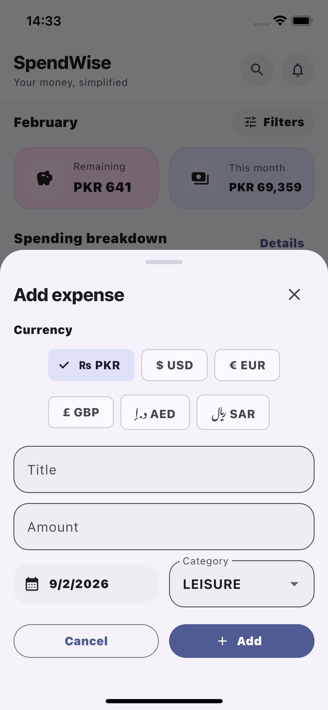
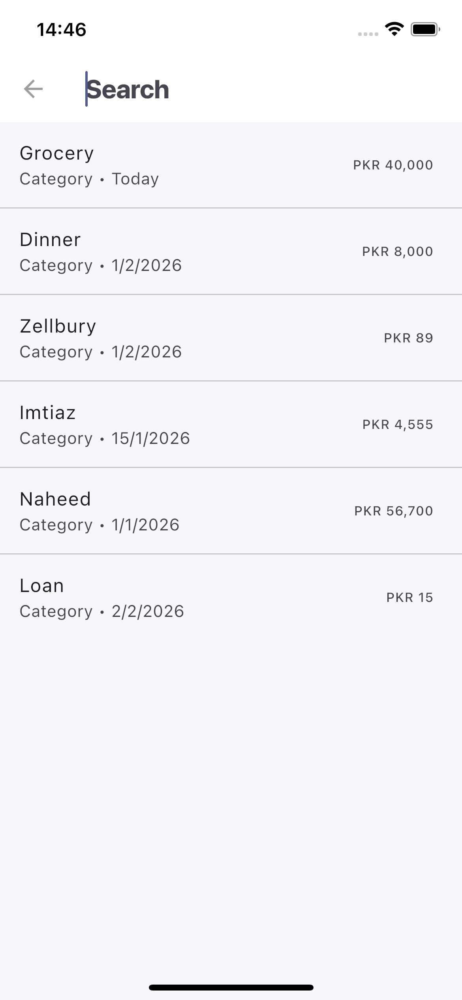

# Expense Tracker App – Flutter (Riverpod Architecture)

A cleanly structured Flutter Expense Tracker application built using Riverpod for state management and a feature-first architecture. This project focuses on scalable app structure, separation of concerns, and modern Flutter best practices, making it suitable both as a learning project and as a portfolio-ready codebase.

## Features

- Add and manage expense records
- Expenses sorted by date (newest first)
- Category-based expense modeling
- Analytics screen for spending insights
- Custom search using SearchDelegate
- Notifications screen architecture (extensible)
- Centralized state management with Riverpod
- Persistent preferences via storage repository
- Light & Dark theme support
- Reusable UI tokens and theming system

## Architecture

- Feature-based folder structure
- Riverpod for global and scoped state management
- Repository pattern for storage abstraction
- Centralized theming and design tokens
- Clear separation of UI, state, and business logic

## 📸 Screenshots

### Dashboard


### Expenses


### Analytics


### Search



## Folder Structure

```
lib/
├── main.dart
│
├── core/
│   ├── money/
│   │   └── currency.dart
│   ├── state/
│   │   ├── app_state.dart
│   │   ├── app_scope.dart
│   │   └── app_riverpod_state.dart
│   ├── storage/
│   │   └── expense_prefs_repository.dart
│   ├── theme/
│   │   ├── app_colors.dart
│   │   ├── app_theme.dart
│   │   └── ui_tokens.dart
│   └── widgets/
│
├── features/
│   ├── analytics/
│   │   └── analytics_screen.dart
│   ├── dashboard/
│   │   ├── dashboard_screen.dart
│   │   └── widgets/
│   ├── expenses/
│   │   ├── expenses_screen.dart
│   │   └── widgets/
│   ├── notifications/
│   │   └── notifications_screen.dart
│   └── search/
│       └── expense_search_delegate.dart
│
└── models/
    ├── expense.dart
    └── app_notification.dart

```

## Getting Started
Clone the repository

### 1. Clone the repository

```bash
git clone https://github.com/your-username/expense-tracker-flutter.git
cd expense-tracker-flutter
```

### 2. Install dependencies

```bash
flutter pub get
```

### 3. Run the app

```bash
flutter run
```

Ensure a device or emulator is connected.

## Tech Stack

- Flutter & Dart
- Riverpod
- Material 3
- Feature-first architecture
- Repository pattern

## License

This project is licensed under the [MIT License](LICENSE).

## Credits

Built as part of a Flutter learning journey with a strong focus on clean architecture, scalability, and maintainability.
